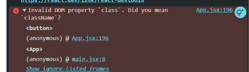

# BootStrap intro

Môn học: FER202 (https://app.notion.com/p/FER202-fabefee53da14556a303630c35ebe5fd?pvs=21)
Ngày học: September 14, 2026
Phân loại: Lý thuyết

Bootstrap - chỉ cần theem class vao

cach dung boostrap

- copy link cdn (Css, jas) vao file index.html
- muon dung style nao cua bootstrap
- thi copy class cua style vao the html cua minh

Lưu ý: Bootstrap là dành cho HTML, còn React là JSX nên khi copy vào sẽ bị lỗi 

- trong React ko có class nên thông thường thuộc tính Class trong HTML sẽ được viết thành className trong JSX
- https://transform.tools/html-to-jsx
- Đi thi ko dùng boostrap
- DÙNG React-Bootstrap: Viết theo cách của React
- Lưu ý: trong đề PE FER 202 chỉ được sử dụng Bootstrap/React-Boostrap
- MUI, Ant Design không được sử dụng trong PE

[https://react-bootstrap.netlify.app/](https://react-bootstrap.netlify.app/)

[https://app.notion.com](https://app.notion.com)

//B1: cài thư viện: npm install react-bootstrap bootstrap → cài 2 thư viện: react-bootstrap và thư viện bootstrap. vì react-bootstrap hoạt động dựa trên bootstrap thuần. 

//B2: import thư viện bootstrap vào file App.jsx hoặc index.js [*import* 'bootstrap/dist/css/bootstrap.min.css';]

//B3: Import component va su dung
(có 2 kiểu import: import Button from 'react-bootstrap/Button';
import { Button } from ‘react-bootstrap’ (destructing)

- cos the su dung cards component