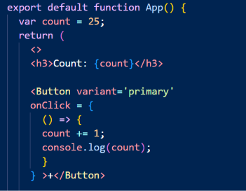

# fer hook useState

Môn học: FER202 (https://app.notion.com/p/FER202-fabefee53da14556a303630c35ebe5fd?pvs=21)
Ngày học: September 17, 2026
Phân loại: Lab

//khi thao tac tren 1 cai bien -> giao dien khong thay doi

//can co cơ chế gì đó để react có thể biết để re-render giao diện 

⇒ HOOK: Các hàm để xử lý một vấn đề gì đó

Để cho REACT biết khi nào cần Render

Khi có một biến thay đổi giá trị ⇒ useState()

⇒ Cách sử dụng

- Cách khai báo
- [bien luu thong tin, ham thay doi gtri cua bien]= useState([gtri khoi tao])
- input là gtri khoi tao
- output la mang

⇒ dùng destructoring

  const [count, setCount] = useState(25);

      setCount(count + 1); va setCount (count ⇒ count + 1) khác nhau ở đâu 

useState áp dụng trong trường hợp nào?