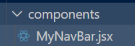

# Router

Môn học: FER202 (https://app.notion.com/p/FER202-fabefee53da14556a303630c35ebe5fd?pvs=21)
Ngày học: September 21, 2026

B1: xóa hết nội dung file App.css, index.css và App.jsx

- B2: Cài react-bootstrap: npm react-bootstrap

https://reactrouter.com/start/modes#declarative

(Single Page Application)

-Routing trong đề PE: tạo 1 thanh Navbar để navigating routes

- Lý do là MyNavBar là để tránh trùng với Navbar của bootsrap

